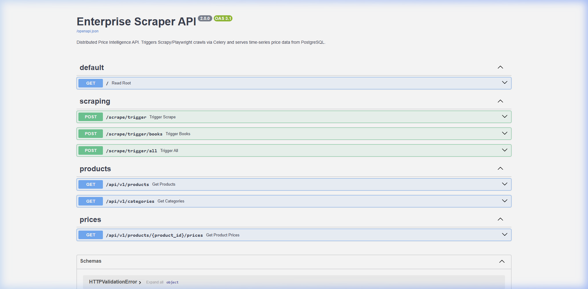
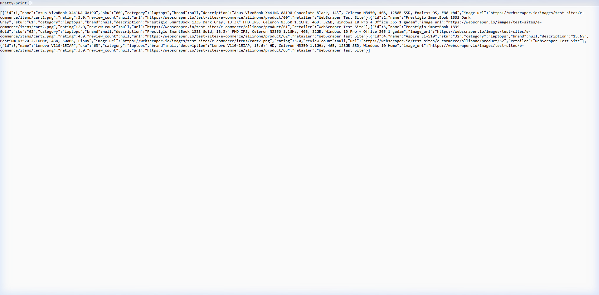
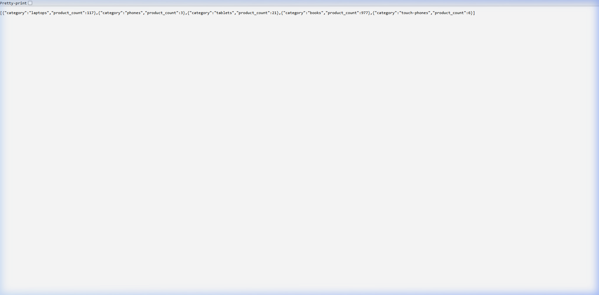
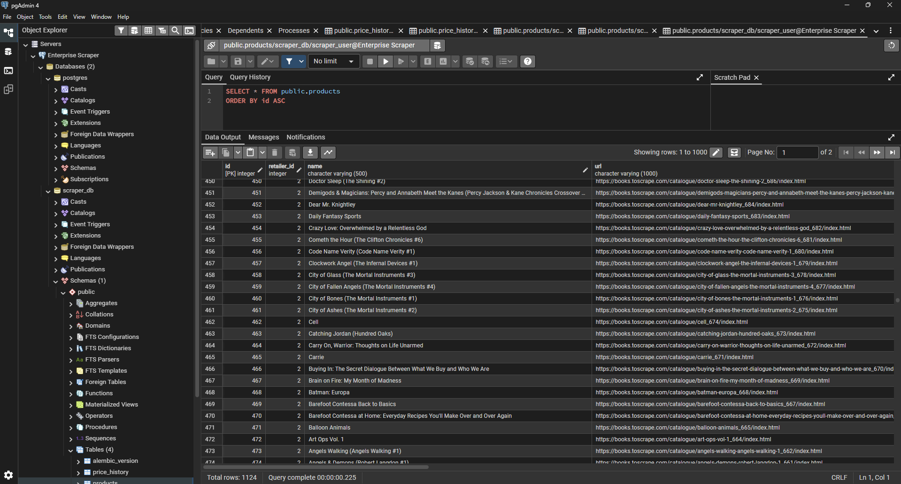

# 🕷️ Enterprise Price Intelligence Scraper

> A production-grade, distributed web scraping pipeline for real-time e-commerce price tracking. Built with Scrapy, Playwright, Celery, FastAPI, PostgreSQL, and Redis — fully containerised with Docker.

---

## 📸 Screenshots

### API Documentation (Swagger UI)


### Live Products Endpoint — Enriched Data


### Categories Summary Endpoint


### pgAdmin — Database View (1,124 Products)


> Shows `scraper_db` with all 4 tables (`alembic_version`, `price_history`, `products`, `retailers`) and the `products` table results — 1,124 total rows, query completed in 0.225s.

**Tables in `scraper_db`:**
| Table | Description |
|---|---|
| `retailers` | Source website metadata |
| `products` | 1,124+ unique products with enriched fields |
| `price_history` | Time-series price snapshots (grows every scrape) |

---

## 🏗️ Architecture

```
┌────────────────────────────────────────────────────────────┐
│                        Docker Compose                       │
│                                                            │
│  ┌──────────┐   POST /scrape   ┌──────────────────────┐   │
│  │          │ ────────────────▶│  Celery Worker        │   │
│  │ FastAPI  │                  │  (Redis Broker)       │   │
│  │ :8000    │◀── JSON ──────── │                       │   │
│  └──────────┘                  │  ┌─────────────────┐  │   │
│       │                        │  │ Scrapy + Play-  │  │   │
│       │                        │  │ wright Spiders  │  │   │
│       ▼                        │  └────────┬────────┘  │   │
│  ┌──────────┐                  └───────────┼───────────┘   │
│  │PostgreSQL│◀──── SQLAlchemy  ────────────┘               │
│  │  :5432   │      ORM + Alembic                           │
│  └──────────┘                                              │
│                                                            │
│  ┌──────────┐                                              │
│  │  Redis   │  ← Task Queue / Result Backend               │
│  │  :6379   │                                              │
│  └──────────┘                                              │
└────────────────────────────────────────────────────────────┘
```

---

## ⚙️ Tech Stack

| Layer | Technology |
|---|---|
| **Scraping** | [Scrapy 2.11](https://scrapy.org/) |
| **JS Rendering** | [Playwright](https://playwright.dev/) via `scrapy-playwright` |
| **Task Queue** | [Celery 5](https://docs.celeryq.dev/) + [Redis 7](https://redis.io/) |
| **API** | [FastAPI](https://fastapi.tiangolo.com/) + [Uvicorn](https://www.uvicorn.org/) |
| **Database** | [PostgreSQL 15](https://www.postgresql.org/) |
| **ORM** | [SQLAlchemy 2](https://www.sqlalchemy.org/) |
| **Migrations** | [Alembic](https://alembic.sqlalchemy.org/) |
| **Validation** | [Pydantic v2](https://docs.pydantic.dev/) |
| **Infrastructure** | [Docker](https://www.docker.com/) + [Docker Compose](https://docs.docker.com/compose/) |

---

## 🗂️ Project Structure

```
enterprise-scraper/
├── docker-compose.yml          # All 4 services: Postgres, Redis, API, Worker
├── Dockerfile                  # Python app image (Playwright-ready)
├── requirements.txt            # Pinned dependencies
├── .env                        # Local environment variables
│
├── alembic/                    # Database migration scripts
│   ├── env.py
│   └── versions/               # Auto-generated migration files
│
├── core/
│   ├── database.py             # SQLAlchemy engine & session factory
│   └── models.py               # ORM models: Retailer, Product, PriceHistory
│
├── scraper/
│   ├── settings.py             # Scrapy + Playwright config
│   ├── items.py                # Scrapy Items + Pydantic validation schema
│   ├── middlewares.py          # User-Agent rotation (anti-bot)
│   ├── pipelines.py            # Validation pipeline + PostgreSQL write pipeline
│   └── spiders/
│       ├── ecommerce_spider.py # Playwright spider → webscraper.io (electronics)
│       └── books_spider.py     # Fast HTTP spider → books.toscrape.com (1,000 books)
│
├── worker/
│   ├── celery_app.py           # Celery app config, Redis broker, Beat schedule
│   └── tasks.py                # 3 Celery tasks: ecommerce, books, full pipeline
│
├── api/
│   └── main.py                 # FastAPI router with all endpoints
│
└── docs/
    └── screenshots/            # Pipeline documentation screenshots
```

---

## 🚀 Quick Start

### Prerequisites

Make sure you have the following installed:
- [Docker Desktop](https://www.docker.com/products/docker-desktop/) (includes Docker Compose)
- [Git](https://git-scm.com/)
- [pgAdmin](https://www.pgadmin.org/download/) *(optional, for visual DB browsing)*

---

### Step 1 — Clone the Repository

```bash
git clone https://github.com/YOUR_USERNAME/enterprise-scraper.git
cd enterprise-scraper
```

---

### Step 2 — Configure Environment Variables

The `.env` file is already set up with local defaults. No changes needed for local development:

```env
POSTGRES_USER=scraper_user
POSTGRES_PASSWORD=scraper_pass
POSTGRES_DB=scraper_db
POSTGRES_HOST=postgres
POSTGRES_PORT=5432
REDIS_URL=redis://redis:6379/0
```

---

### Step 3 — Build and Start All Services

```bash
docker compose up -d --build
```

This starts **4 containers**:

| Container | Service | Port |
|---|---|---|
| `enterprise_scraper_db` | PostgreSQL 15 | `5432` |
| `enterprise_scraper_redis` | Redis 7 | `6379` |
| `enterprise_scraper_api` | FastAPI | `8000` |
| `enterprise_scraper_worker` | Celery Worker | — |

Verify all are running:
```bash
docker ps
```

---

### Step 4 — Apply Database Migrations

Run once after first startup to create all tables:

```bash
# Generate migration file from SQLAlchemy models
docker exec enterprise_scraper_api bash -c "alembic revision --autogenerate -m 'initial_schema'"

# Apply migrations to create tables in PostgreSQL
docker exec enterprise_scraper_api bash -c "alembic upgrade head"
```

---

### Step 5 — Trigger Your First Scrape

**Option A — Full pipeline (all spiders, recommended):**
```bash
curl -X POST http://localhost:8000/scrape/trigger/all
```

**Option B — Electronics only (webscraper.io):**
```bash
curl -X POST http://localhost:8000/scrape/trigger
```

**Option C — Books only (books.toscrape.com, 1,000 books):**
```bash
curl -X POST http://localhost:8000/scrape/trigger/books
```

> The scrape runs **asynchronously**. The API returns immediately with a `task_id`. The Celery worker processes the job in the background (usually 15–60 seconds depending on network).

---

### Step 6 — View the Results

Open your browser and visit:

| URL | Description |
|---|---|
| [`http://localhost:8000/docs`](http://localhost:8000/docs) | **Swagger UI** — Interactive API docs |
| [`http://localhost:8000/api/v1/products`](http://localhost:8000/api/v1/products) | All scraped products (JSON) |
| [`http://localhost:8000/api/v1/categories`](http://localhost:8000/api/v1/categories) | Product count by category |
| [`http://localhost:8000/api/v1/products/1/prices`](http://localhost:8000/api/v1/products/1/prices) | Price history for product ID 1 |

---

## 🐘 Connecting pgAdmin (Visual Database Browser)

1. Install and open [pgAdmin](https://www.pgadmin.org/download/)
2. Right-click **Servers** → **Register** → **Server...**
3. Fill in the connection details:

| Field | Value |
|---|---|
| **Name** | `Enterprise Scraper` *(anything)* |
| **Host** | `localhost` |
| **Port** | `5432` |
| **Username** | `scraper_user` |
| **Password** | `scraper_pass` |
| **Database** | `scraper_db` |

4. Expand: `Enterprise Scraper → Databases → scraper_db → Schemas → public → Tables`
5. Right-click any table → **View/Edit Data → All Rows**

**Useful SQL queries to run in pgAdmin:**
```sql
-- Total products per category
SELECT category, COUNT(*) FROM products GROUP BY category ORDER BY COUNT(*) DESC;

-- Latest price for each product
SELECT p.name, p.category, ph.price, ph.currency, ph.scraped_at
FROM products p
JOIN price_history ph ON ph.product_id = p.id
WHERE ph.scraped_at = (
    SELECT MAX(scraped_at) FROM price_history WHERE product_id = p.id
)
ORDER BY p.category, p.name
LIMIT 50;

-- Time-series: how a product's price changes over scrapes
SELECT ph.price, ph.scraped_at FROM price_history ph WHERE product_id = 1 ORDER BY ph.scraped_at;
```

---

## 📡 API Reference

### Scraping Endpoints

| Method | Endpoint | Description |
|---|---|---|
| `POST` | `/scrape/trigger` | Run electronics spider (webscraper.io) |
| `POST` | `/scrape/trigger/books` | Run books spider (1,000 books) |
| `POST` | `/scrape/trigger/all` | Run **all spiders** — maximum data |

### Data Endpoints

| Method | Endpoint | Query Params | Description |
|---|---|---|---|
| `GET` | `/api/v1/products` | `?skip=0&limit=100&category=laptops` | List all products with enriched metadata |
| `GET` | `/api/v1/categories` | — | Product counts per category |
| `GET` | `/api/v1/products/{id}/prices` | — | Full price history for one product |

### Sample Response — `/api/v1/products`
```json
[
  {
    "id": 1,
    "name": "Lenovo IdeaPad 320-15ABR",
    "sku": "88",
    "category": "laptops",
    "brand": null,
    "description": "Lenovo IdeaPad 320, 15.6\" HD, A9-9420 3GHz...",
    "image_url": "https://webscraper.io/.../88.jpg",
    "rating": 3.0,
    "review_count": null,
    "url": "https://webscraper.io/.../product/88",
    "retailer": "WebScraper Test Site"
  }
]
```

---

## 🕷️ Spiders

### `ecommerce` — Electronics (webscraper.io)
- **Rendering:** Playwright (handles JavaScript SPAs)
- **Categories:** Laptops, Tablets, Phones, Touch Phones
- **Products:** ~147 unique items
- **Trigger:** `POST /scrape/trigger`

### `books` — Books to Scrape (books.toscrape.com)
- **Rendering:** Standard HTTP (high-performance, no JS needed)
- **Categories:** 50 genres (Fiction, Mystery, Science, etc.)
- **Products:** 1,000 unique books
- **Trigger:** `POST /scrape/trigger/books`

---

## 🛡️ Anti-Bot Measures

- **User-Agent Rotation** — Random browser User-Agent on every request
- **Playwright Rendering** — Full Chrome browser for JS-heavy pages
- **Rate Limiting** — Configurable download delay between requests
- **Proxy Scaffolding** — `ProxyRotatorMiddleware` ready for enterprise proxy integration

---

## 📈 Data Growth Pattern

Every time you call `/scrape/trigger/all`, the system:
1. Re-scrapes **all** product pages
2. **Upserts** product metadata (price, rating, description)
3. **Appends** a new `price_history` row per product

This creates a **time-series price intelligence dataset**. Run it daily and you'll track price changes over time across 1,000+ products.

```bash
# Example: run full scrape 5 times to build history
for i in 1 2 3 4 5; do
  curl -X POST http://localhost:8000/scrape/trigger/all
  sleep 30
done
```

---

## 🔄 Stopping and Restarting

```bash
# Stop all services (keeps data)
docker compose down

# Restart everything
docker compose up -d

# Full reset (DELETES all data)
docker compose down -v
```

---

## 🧰 Useful Docker Commands

```bash
# View live logs from the Celery worker
docker logs enterprise_scraper_worker -f

# View API logs
docker logs enterprise_scraper_api -f

# Open a database shell
docker exec -it enterprise_scraper_db psql -U scraper_user -d scraper_db

# Run a spider directly (for testing)
docker exec enterprise_scraper_worker bash -c "python -m scrapy crawl books"
```

---

## 🗄️ Database Schema

```
retailers
├── id (PK)
├── name
├── domain (unique)
└── created_at

products
├── id (PK)
├── retailer_id (FK → retailers)
├── name
├── url (unique)
├── sku
├── category          ← indexed for fast filtering
├── description
├── image_url
├── rating
├── review_count
├── brand
├── created_at
└── updated_at

price_history
├── id (PK, BigInteger)
├── product_id (FK → products)
├── price
├── currency
├── in_stock
└── scraped_at        ← indexed for time-series queries
```

---

## 📋 License

MIT License — free to use, modify and distribute.
